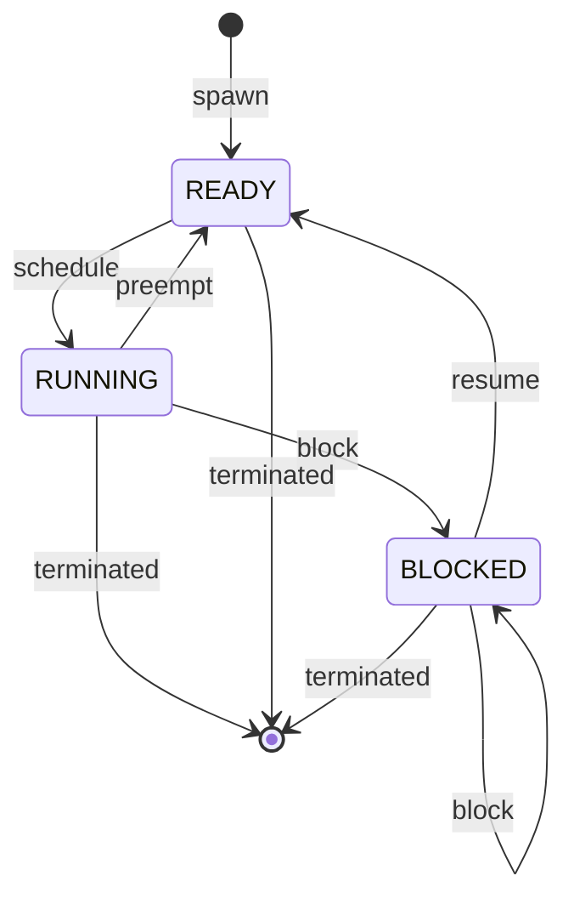

# Operating Systems Exercise 2
## Kernel-mode, User-mode and the in-between
Course: Operating Systems - Reichman University
Document date: 12.05.2026
Due date: 13.06.2026 (submit via INGInious; no late submissions)

## Acknowledgments
We would like to thank the Hebrew University for the original idea and examples.

## Submission rules (read carefully)
- Work in pairs (exactly two students per team).
- Submission is made through the INGInious system.
  - For the programming part, submit the `uthread` library implementation files as a single ZIP file, including `uthreads.c` and any private helper `.c`/`.h` files you add.
    - Do not modify `uthreads.h`, `jump.c`, or `jump.h`, including the structs. Also, do not submit these files.
    - Do not submit compiled binaries.
    - Do not submit `testuthreads.c`. You should write it locally to test your implementation, but the submitted implementation files must not contain a `main()` function.
  - For the theoretical part, submit a PDF file containing your answers. Hand-written scans in the PDF are not approved and will be declined. The submission must be typed, including math.
  - When you submit, also include your names and IDs according to the accepted format. See the instructions in the INGInious submission page.
- The assignment is graded on Ubuntu x86_64 architecture in the INGInious environment.
  - `jump.c` and `jump.h` support both x86_64 and ARM64, so Mac M-series users may work locally on ARM64.
  - However, local ARM64 execution is not identical to the grading environment. Make sure your code also works successfully in INGInious.
- The INGInious grader uses Ubuntu 24.04 LTS, GCC 13, and GNU/C 17 (C17 with GNU extensions). To compile by yourself, use `gcc-13 -std=gnu17`. Make sure your code works successfully in this environment.
- You may submit your exercise as many times as you want until the due date. Your last submission is the one that will be graded. Submitting after the due date without explicit approval will not be graded and will be considered as not submitted.
- All source code will be scanned using plagiarism and LLM-detection tools. If suspicious similarity is detected, the team(s) may be investigated for academic misconduct according to university policy.

---

# Part A - Theory (submit as a separate PDF)
Submit answers in a single PDF file.

## TQ1 - Calculation: `int 0x80` vs `syscall`

### Problem
A user-space program performs $N = 10,000$ `write()` system calls in a tight loop.

In the lecture, we saw two ways a user-mode program can enter the kernel for a system call:
1. The legacy `int 0x80` instruction, which uses the general software-interrupt mechanism.
2. The modern `syscall` instruction, which is a special CPU instruction for system calls.

Both mechanisms move the running thread from user mode to kernel mode. This is not a context switch to another thread or process. The same thread continues running, but now it executes kernel code.

For this question, use the following simplified cost model. The numbers are artificial and are given only for the calculation.

The two paths share these per-syscall stages:

| Stage | Cost (cycles) |
| --- | --- |
| Enter kernel mode and switch to the kernel execution state | 250 |
| `syscall_dispatch` - use the syscall number to select the requested kernel service | 50 |
| Kernel work - the actual `sys_write` implementation | 2,000 |
| Return from kernel mode back to user mode | 200 |

The legacy `int 0x80` path additionally pays:

| Stage | Cost (cycles) |
| --- | --- |
| IDT lookup for software interrupt entry `0x80` | 80 |
| General interrupt/trap entry path - save full trap state, identify the trap cause, then reach syscall dispatch | 220 |

The modern `syscall` path additionally pays:

| Stage | Cost (cycles) |
| --- | --- |
| Jump to the syscall entry address configured by the kernel in MSR_LSTAR | 30 |
| Dedicated syscall entry path - save the minimal syscall state and prepare to call syscall dispatch, without the general trap-cause classification | 70 |

### Tasks
1. Compute the total cost per syscall on each path.
2. Compute the total number of cycles for the full workload on each path, and the absolute savings of using the modern `syscall` path.
3. Compute the overhead percentage on each path, where overhead is defined as everything except the 2,000 cycles of actual `sys_write` kernel work.
4. **Break-even**: Suppose that in a toy OS, supporting the modern `syscall` path requires a one-time setup cost of $C = 10,000$ cycles before the workload begins. The legacy `int 0x80` path has no such setup cost. What is the minimum number of syscalls $N$ for which using the modern `syscall` path is strictly cheaper than using the legacy `int 0x80` path?

---

## TQ2 - Kernel entry mechanisms and signal delivery

### Problem
In the lecture, we saw several ways execution can move between user-mode code and kernel-mode code:
- A **system call**, where the program intentionally asks the OS for a service.
- An **exception**, where the CPU detects that the running program did something invalid or unexpected.
- A **software interrupt**, where the program explicitly executes an `int X` instruction.
- A **signal**, where the OS notifies a user-mode process or thread about an event.

In this question, labels of the form E1, E2, etc. mean Event 1, Event 2, etc.

Consider the following simplified program with two POSIX threads, `T1` and `T2`.

```c
#include <signal.h>
#include <stdio.h>
#include <unistd.h>

void handler(int sig)
{
     printf("handler\n");
}

void* T1_main(void* arg)
{
     signal(SIGUSR1, handler);

     write(STDOUT_FILENO, "A", 1);                   // E1

     __asm__ volatile("int $3");                     // E2

     int x = 1 / 0;                                  // E3

     return NULL;
}

void* T2_main(void* arg)
{
     sigset_t set;
     int sig;

     sigemptyset(&set);
     sigaddset(&set, SIGUSR1);

     pthread_sigmask(SIG_BLOCK, &set, NULL);              // E4

     sigwait(&set, &sig);                                 // E5

     return NULL;
}
```

**Note:** The line `__asm__ volatile("int $3");` is GNU C inline assembly. It asks the compiler to emit the x86-64 instruction `int 3`. The keyword `volatile` tells the compiler that the assembly should not be optimized away. This line is used here only so we can explicitly discuss a software interrupt.

Assume the following:
1. The program runs on x86-64 Linux.
2. The program is compiled with GCC or Clang, so the GNU-style inline assembly in E2 is accepted.
3. The `write()` call in E1 eventually uses the `syscall` instruction.
4. The division by zero in E3 is actually executed, and for this question we assume it causes a CPU exception that the OS reports to the process using `SIGFPE`.
5. No custom handler is registered for `SIGFPE`.
6. An external process sends `SIGUSR1` to this process using `kill(pid, SIGUSR1)` while `T2` is already waiting in `sigwait()`.
7. For signal delivery, use the POSIX signal-priority model presented in the lecture: a thread waiting in `sigwait()` for a signal receives it before the signal is delivered to a regular signal handler.
8. The low-level `write()` expects a file as a file descriptor, which is of type `int`. `STDOUT_FILENO` is of type `int`, unlike the known `STDOUT` to `fprintf` which is of type `FILE*`.

### Tasks
1. For each event E1 - E5, classify the mechanism involved. Use one of the following labels:
   - system call
   - software interrupt
   - exception
   - signal masking
   - signal waiting
2. For E1, E2, and E3, answer:
   i. Does the CPU enter kernel mode?
   ii. Is this necessarily a context switch to another thread or process?
   iii. What is the main reason the kernel was entered?
3. When an external process sends `SIGUSR1`, which thread handles or receives it: `T1` through `handler`, or `T2` through `sigwait`? Explain why.
4. For each of the following statements, say whether it is true or false, and correct the false statements:
   i. "A system call is a context switch from the user process to a kernel process."
   ii. "`int 3` is a system call because it uses the `int` instruction."
   iii. "The signal handler must run in the same thread that called `signal(SIGUSR1, handler)`."
   iv. "`sigwait` waits for a signal without running the signal handler."
   v. "If no custom handler is registered for an exception-related signal such as `SIGFPE`, the OS uses the signal's default behavior."

---

## TQ3 - Synchronization: Signal delivery while holding a mutex

### Problem
Consider the following multi-threaded program:

```c
int counter = 0;
pthread_mutex_t lock = PTHREAD_MUTEX_INITIALIZER;

// Thread A - incrementer
void* incrementer(void* arg) {
     // A1
     pthread_mutex_lock(&lock);
     counter++;
     pthread_mutex_unlock(&lock);
     // A2

     return NULL;
}

// Thread B - reader
void* reader(void* arg) {
     int v;

     // B1
     pthread_mutex_lock(&lock);
     v = counter;
     pthread_mutex_unlock(&lock);
     // B2

     printf("%d\n", v);
     return NULL;
}

// SIGUSR1 handler
void handler(int sig) {
     pthread_mutex_lock(&lock);
     counter--;
     pthread_mutex_unlock(&lock);
}
```

**Note:** The signal handler in this question is intentionally unsafe. In real code, a signal handler should not call functions such as `pthread_mutex_lock`. In this question, analyze the code as written so we can understand what can go wrong.

Assume the following:
1. Thread A runs `incrementer` exactly once.
2. Thread B runs `reader` exactly once.
3. `SIGUSR1` is sent to the process exactly once during the execution.
4. The signal is process-directed, so the kernel may deliver it to either Thread A or Thread B.
5. No signal mask is set initially.
6. Assume the only threads that may receive a signal are A and B.
7. The mutex is non-recursive. If a thread that already holds `lock` tries to lock it again, it blocks forever.

### Tasks
1. **Possible orders without interruption inside a critical section.**
   For this task only, assume the signal handler does not interrupt A or B in the middle of their critical section. Instead, assume that each of A, B, and H runs its critical section from beginning to end before the next one starts.
   Here, H means the execution of the signal handler.
   Fill in the table below.
   Remember:
   - A increments counter by 1.
   - B reads counter and later prints the value it read.
   - H decrements counter by 1.

   | | Order of critical sections | Value printed by B | Final value of counter |
   | --- | --- | --- | --- |
   | 1 | A -> B -> H | | |
   | 2 | A -> H -> B | | |
   | 3 | B -> A -> H | | |
   | 4 | B -> H -> A | | |
   | 5 | H -> A -> B | | |
   | 6 | H -> B -> A | | |

2. **Deadlock.**
   In Task 1, we assumed that the signal handler does not interrupt A or B in the middle of their critical section.
   Now remove that assumption: `SIGUSR1` may arrive while Thread A or Thread B is already inside its critical section.
   Explain exactly when this program can deadlock. Answer in terms of:
   i. which thread receives the signal,
   ii. what that thread was doing at the moment the signal arrived,
   iii. why the program gets stuck.

3. **Preventing the deadlock with signal masking.**
   We want to prevent the deadlock without changing the signal handler. You may use `sigprocmask`, but you must not block `SIGUSR1` forever in Thread A or Thread B. The program should still be able to receive and handle `SIGUSR1` when it is safe to do so.
   Using the markers A1, A2, B1, and B2 in the code above, answer:
   i. In which thread or threads should `SIGUSR1` be temporarily blocked?
   ii. At which marker or markers should `SIGUSR1` be blocked?
   iii. At which marker or markers should the previous signal mask be restored?
   iv. Explain why this prevents the deadlock.
   v. Explain why this does not block `SIGUSR1` forever.

---

## TQ4 - User-level switching with `sigsetjmp` / `siglongjmp`

### Problem
In this question, `uthread` means user-level thread: a thread managed by our program using saved contexts, not a separate POSIX/kernel thread.

The following simplified program runs two uthreads on a single POSIX thread.

Each uthread has:
- its own stack,
- its own saved context in `env[tid]`,
- a function that starts running when we jump to that context.

In this question, assume `setup_context` and `uthread_terminate` are already implemented correctly. You do not need to implement them.

```c
#include <stdio.h>
#include <setjmp.h>

#define STACK_SIZE 4096

typedef void (*thread_entry_point)(void);

sigjmp_buf env[2];

char stack0[STACK_SIZE];
char stack1[STACK_SIZE];

int current_uthread = -1;
int done[2] = {0, 0};

/*
* Initializes env[tid] so that the first siglongjmp(env[tid], 1)
* starts running entry_point on the given stack.
*
* Treat this function as a black box for this question.
*/
void setup_context(int tid, char *stack, thread_entry_point entry_point);

/*
* Terminates the given uthread.
*
* If the terminated uthread is the currently running uthread, this function
* does not return to that uthread. Instead, it switches to another runnable
* uthread if one exists. If no runnable uthread exists, the program ends.
*
* Treat this function as a black box for this question.
*/
int uthread_terminate(int tid);

/*
* BUGGY VERSION.
*/
void switch_to(int tid)
{
     siglongjmp(env[tid], 1);
     current_uthread = tid;
}

void yield(void)
{
     int me = current_uthread;
     int other = 1 - me;

     if (sigsetjmp(env[me], 1) == 0) {
         switch_to(other);
     }
}

void uthread_here(void)
{
      printf("I'm here\n");
      yield();

      printf("I'm here again\n");
      done[0] = 1;
      uthread_terminate(current_uthread);
}

void uthread_there(void)
{
      printf("I'm there\n");
      yield();

      printf("I'm there again\n");
      done[1] = 1;
      uthread_terminate(current_uthread);
}

int main(void)
{
      setup_context(0, stack0, uthread_here);
      setup_context(1, stack1, uthread_there);

      switch_to(0);

      return 0;
}
```

### Tasks
1. The function `switch_to` contains a bug. Find the bug and explain it. Your answer should explain:
   i. what the bug is,
   ii. how `siglongjmp` affects the execution of `switch_to`,
   iii. why this bug causes `yield()` to save the wrong uthread context.
2. Write the corrected version of `switch_to`.
3. For the rest of this question, assume `switch_to` has been fixed. Write the output of the program from the moment `main` calls `switch_to(0)` until the two uthreads terminate.
4. For the corrected version, explain what happens inside `yield()` when:
   i. `sigsetjmp(env[me], 1)` returns 0,
   ii. `sigsetjmp(env[me], 1)` returns non-zero.
5. Can running this program on a computer with two CPU cores speed up the uthreads by achieving true parallelism? If yes, explain why. If not, explain why not.

---

# Part B - Programming

## What you are implementing
In this assignment, you will build a static library, meaning compiled code without `main()`, that creates and manages uthreads.

A uthread is a user-level thread: a thread managed by your library inside a single process, using saved execution contexts. It is not an OS thread and it is not a POSIX `pthread`.

Your library's public API is defined in `uthreads.h`.

Your primary task is to implement all the functions specified in the uthreads API according to their documentation. You may also design and implement internal helper functions and data structures. There is no restriction on how many internal components you use or what form they take, as long as you follow the requirements below.

## The uthreads
Every program begins with a default main uthread, which has uthread ID 0. All other uthreads must be explicitly created by the uthread library.

Each uthread is assigned a unique, non-negative integer as its ID. When creating a new uthread using `uthread_spawn`, you must assign it the smallest non-negative integer that is not currently in use. For example, if uthread 1 terminates and a new uthread is created, the new uthread should receive ID 1.

The library must support at most `MAX_THREAD_NUM` uthreads at any time, including the main uthread.

Every active uthread is always in one of the following states:
- RUNNING
- BLOCKED
- READY

### Uthread state diagram



## Provided files
You are given the following files:
- `uthreads.h`
- `jump.c`
- `jump.h`

Do not modify `uthreads.h`, `jump.c`, or `jump.h`.
Do not submit `uthreads.h`, `jump.c`, or `jump.h`. The INGInious checker will use the official versions of these files.

### Provided context setup helpers: `jump.c` and `jump.h`
The files `jump.c` and `jump.h` contain helper code for initializing a uthread context, including setting the saved stack pointer and program counter in the jump buffer.

You must compile your implementation together with `jump.c`, and include `jump.h` where needed.

`jump.c` and `jump.h` include support for both x86_64 and ARM64. Therefore, Mac M-series users may work locally on ARM64. However, grading is done in the INGInious environment on Ubuntu x86_64, so you are expected to test your solution in INGInious as well. You may submit and run the checker as many times as you want until the due date.

## Scheduler
Your library must include a scheduler that manages uthread execution using the Round-Robin (RR) scheduling algorithm.

Round-Robin works by allocating a fixed time slice, called a quantum, to each uthread when it enters the RUNNING state.

Only one uthread runs at any moment, because all uthreads are managed inside a single OS/POSIX thread.

## Time
The process running time is measured by the virtual timer. Virtual time refers to the amount of CPU time a process actually uses, rather than the real, wall-clock time that passes in the system.

This distinction is important for understanding how uthreads are scheduled and managed in this assignment.

**Virtual time**
- Measures the CPU time consumed by the process.
- Advances only when the process is actively running.
- Used to allocate and monitor a uthread's quantum.
- Typically implemented using the `setitimer` system call with the `ITIMER_VIRTUAL` option.

**Wall-clock time**
- Represents the actual elapsed time in the real world.
- Includes all time intervals, whether the process is running, waiting, or blocked.
- Is not used for scheduling in this assignment, since we focus only on the process's active virtual running time.

The following example demonstrates how to configure a virtual timer.
*Note: This example prints to stdout only to demonstrate timer behavior. Your uthreads library itself must not print anything to `stdout`.*

```c
#include <stdio.h>
#include <signal.h>
#include <sys/time.h>
#include <unistd.h>

void timer_handler(int signum) {
    printf("Timer signal received: %d\n", signum);
}

int main(void) {
    struct sigaction sa;
    struct itimerval timer;

    // Set up the signal handler for SIGVTALRM.
    sa.sa_handler = timer_handler;
    sigemptyset(&sa.sa_mask);
    sa.sa_flags = 0;

    if (sigaction(SIGVTALRM, &sa, NULL) == -1) {
         perror("sigaction");
         return 1;
    }

    // Configure the virtual timer.
    timer.it_value.tv_sec = 0;
    timer.it_value.tv_usec = 500000;             // First signal after 0.5 seconds of CPU time.
    timer.it_interval.tv_sec = 0;
    timer.it_interval.tv_usec = 500000;          // Then every 0.5 seconds of CPU time.

    if (setitimer(ITIMER_VIRTUAL, &timer, NULL) == -1) {
        perror("setitimer");
         return 1;
    }

    // CPU-bound loop so the virtual timer counts down.
    while (1) {
         // Perform some CPU-bound task. This loop will trigger timer signals.
    }

    return 0;
}
```

## Algorithm
The Round-Robin scheduling policy should operate as follows:

1. **Quantum allocation:** Whenever a uthread enters the RUNNING state, it is allocated a fixed number of microseconds to execute, called the quantum.
2. **Preemption conditions:** The currently running uthread is preempted if:
   i. Its allocated quantum expires.
   ii. It voluntarily blocks itself.
   iii. It voluntarily goes to sleep.
   iv. It terminates, either by its own action or via a call from another uthread.
3. **Handling timer preemption:** When a uthread is preempted because its quantum expires, move it to the end of the READY queue, then schedule the next uthread from the front of the READY queue.
4. **Handling voluntary preemption:** If the running uthread blocks itself, sleeps, or terminates itself, the scheduler must immediately choose another READY uthread to run.
5. **Operations on other uthreads:** If the running uthread blocks, resumes, or terminates another uthread, the running uthread continues running unless the operation specifically removes the running uthread itself from execution.
6. **Queue management:** Every time a uthread transitions into the READY state from another state, it should be added to the end of the READY queue.
7. **No duplicate READY entries:** A uthread must appear in the READY queue at most once. Do not add a uthread to the READY queue if it is already READY.
8. **Partial quantum usage:** If a uthread does not consume its entire quantum, for instance if it blocks or sleeps before the quantum expires, the scheduler should immediately start the next uthread as though the previous uthread had fully used its time slice.
9. **Timer reset:** Whenever the scheduler switches to a uthread and starts a new quantum, the virtual timer must be reset to a full quantum of `quantum_usecs`.

## Quantum counting
The total quantum count starts at 1 immediately after `uthread_init`, because the main uthread begins running its first quantum.

A new quantum begins whenever a uthread becomes RUNNING, regardless of the reason. This includes timer expiration, blocking, sleeping, termination, or explicit scheduling after another uthread stops running.

Therefore:
- `uthread_init` starts the first quantum of the main uthread, so the total quantum count becomes 1.
- Whenever a uthread is scheduled to run, the total quantum count is incremented.
- Whenever a uthread is scheduled to run, that uthread's own quantum count is incremented.
- A newly spawned uthread has quantum count 0 until it runs for the first time.
- For a uthread in the RUNNING state, its current quantum is included in `uthread_get_quantums(tid)`.

## Blocking and sleeping
A uthread may be inactive for two independent reasons:
1. It was explicitly blocked using `uthread_block`.
2. It is sleeping because it called `uthread_sleep`.

A uthread becomes READY only when neither reason applies.

Therefore:
- `uthread_resume(tid)` clears only the explicit blocking reason.
- `uthread_resume(tid)` does not wake a sleeping uthread early.
- When a sleep period expires, the uthread becomes READY only if it is not still explicitly blocked.
- If a uthread is both explicitly blocked and sleeping, it remains inactive until both conditions are resolved.

### Sleep timing example
The current quantum is not counted as part of the sleep duration.

For example, suppose the total quantum count is currently 7, and the running uthread calls:

```c
uthread_sleep(2);
```

The current quantum, quantum 7, is not counted.
The uthread should not run during quantums 8 and 9. It may become READY when quantum 10 begins, assuming it is not also explicitly blocked.
Calling `uthread_sleep(num_quantums)` with `num_quantums <= 0` is a thread library error.
The main uthread, meaning `tid == 0`, is not allowed to sleep.

## Library functions
The API for your uthread library is defined in the header file `uthreads.h`.

When these functions are called, they will cause state transitions as shown in the state diagram. A uthread may invoke a function on its own ID, affecting its own state, or on another uthread's ID, affecting that uthread's state.

### Notes
1. You must implement and manage a data structure, such as a queue or list, to maintain the uthreads in the READY state. You are free to use any additional data structures that help achieve the required functionality.
2. The main uthread, meaning `tid == 0`, operates using the same stack, program counter, and registers that were active when `uthread_init` was called. Therefore, you do not need to allocate a separate stack or manually set its SP and PC. Nonetheless, it should be managed just like any other uthread during context switches.
3. You must protect your critical state update sections with signal masking to prevent a user-level context switch caused by the timer signal and prevent state corruption. If any masking operation fails, print `system error: masking failed` to `stderr` and exit the process with exit code 1.
4. You are not allowed to use dynamic allocations, including `malloc`. You may use static arrays to manage the uthread TCBs and uthread stacks.
5. Include `uthreads.h` in your source files.
6. Use the uthread context initialization helper from `jump.h` and `jump.c`.
7. Compile your implementation together with `jump.c`.
8. The uthreads library itself must not print anything to `stdout`. Test programs and uthread entry functions may print to `stdout` if they want. Library error messages must be printed only to `stderr`.
9. You must not call any memory allocation/deallocation functions (for example, `malloc`, `calloc`, `free` and so on). Since the maximal number of threads is already known in compilation time, you can use a static global array for thread management (including the stack), which is of size `MAX_THREAD_NUM` and of type `struct thread` (which you will create).

### Simplifying assumptions
You may assume the following:
1. A uthread entry function never returns normally. If a uthread finishes its work by itself, it calls `uthread_terminate(uthread_get_tid())` before returning from the entry function.
2. A uthread may still be terminated earlier by another uthread calling `uthread_terminate(tid)`.
3. The allocated stack space for each spawned uthread is sufficient and will not be exceeded during execution.
4. Neither the main uthread nor any uthread created via the uthreads library will manipulate timer signals, specifically `SIGVTALRM`, by sending them, masking them, or setting interval timers for them.

### Error messages
Your library must output error messages exclusively to `stderr`. No output should be sent to `stdout` by the library itself.

#### System call failure
When a system call fails, print a single line in the following format:
```text
system error: text
```
Here, `text` should briefly describe the error. After printing, immediately call `exit(1)`.

#### Thread library failure
When a function in your uthread library encounters an error, for example invalid input, print a single line in the following format:
```text
thread library error: text
```
Here, `text` should briefly describe the error. Then, return the appropriate error value from the function.

## Background reading and resources
To gain a complete understanding of the relevant system calls, consult the following man pages:
- `setitimer (2)`
- `getitimer (2)`
- `sigaction (2)`
- `sigsetjmp (3)`
- `siglongjmp (3)`
- `sigprocmask (2)`
- `sigemptyset`, `sigaddset`, `sigdelset`, `sigfillset`, `sigismember (3)`
- `sigpending (2)`
- `sigwait (3)`

## Example: using sigaction with SIGINT

```c
#include <stdio.h>
#include <stdlib.h>
#include <signal.h>
#include <unistd.h>

// Signal handler for SIGINT
void signal_handler(int signum) {
    printf("Received signal %d (SIGINT). Exiting gracefully...\n", signum);
    exit(0);
}

int main(void) {
    struct sigaction sa;

    // Set up the sigaction structure to specify the signal handler.
    sa.sa_handler = signal_handler;            // Set the signal handler function.
    sigemptyset(&sa.sa_mask);                  // No additional signals blocked during execution of the handler.
    sa.sa_flags = 0;                           // No special flags.

    // Register the signal handler for SIGINT.
    if (sigaction(SIGINT, &sa, NULL) == -1) {
        perror("sigaction");
        exit(1);
    }

    printf("Program is running. Press Ctrl+C to trigger SIGINT.\n");

    // Main loop: the program will continue running until it receives SIGINT.
    while (1) {
        sleep(1);
    }

    return 0;
}
```

## Final notes
- **Read the instructions carefully:** Ensure that you adhere to all restrictions and requirements.
- **Testing:** Test your code thoroughly with various inputs to ensure correctness, especially under concurrent execution.
  - Also test without a debugger since debuggers may affect synchronization behavior and hide bugs.
  - Debugging: Start with a small number of uthreads, e.g. one, then two, then five, and increase gradually.
  - Use debug printouts to help identify issues, but make sure to remove or comment out any debug messages before submission since they may affect grading.
- **Code quality:** Write clean, well-commented code to help the graders understand your implementation. Comments will also help you understand what you are trying to achieve.
- **Unit tests:** You are more than encouraged to use unit tests to validate your synchronization mechanisms.
- **Grading reminder:** A happy grader is a merciful grader!

Good Luck! 🦾